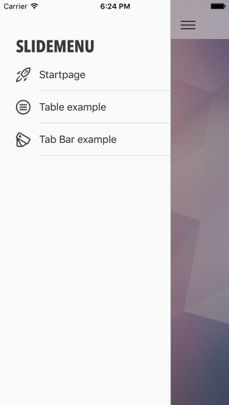
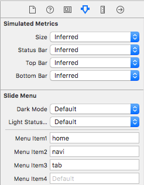
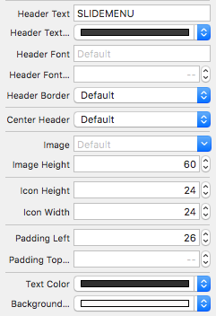

# JESlideMenu – iOS Slide-out Menu in Swift

JESlideMenu is an easy to use slide-out menu written in Swift 3. The slide-out menu can be easily added in an existing project. The design is completely written in code with autolayout, including a hamburger/toggle button. Therefore there is no need to add a toggle button, but you can if you want to.

## Requirements
- Xcode 8.x
- iOS 9 or above

## Preview
This is what the slider looks like without any customization. Only the headline **SIDEMENU** was added.

 



Screenshot from the example project. The menu and navigation bar was adjusted via the attributes inspector in the storyboard. The example project features icons created by [iconmonstr.com](https://iconmonstr.com).





## Features
- completely written in Swift 3
- install & adjust slide-out menu without writing any code (@IBInspectable)
- premade menu design
- pan/swipe and tap gestures for opening and closing
- adjust the color of the navigation bar
- adjust cell padding and header size
- adjust text & background color
- supports autolayout
- supports localization
- supports landscape/portrait
- light status bar
- menu header image or headline
- menu icons
- custom fonts for headline
- dark mode
- supports: iPhone 5/6/7 & iPad

## How to install
- drag & drop the file JESlideMenu.swift (copy if needed checked)
- drag & drop new View Controller in your storyboard and select JESlideMenu as class
- make it your initial View Controller
- give all your controllers (view, navigation, tab bar controller, etc.) a Storyboard ID in identity inspector
- enter the Storyboard IDs in the text fields (Menu Item 1...) in attributes inspector of JESlideMenu
- style the menu via attributes inspector of JESlideMenu in the storyboard
- run the app

## Select custom font for menu headline
Use the following class methods to get all available fonts in your project.

```
JESlideMenu.printInstalledFonts()			// prints all available fonts

JESlideMenu.printFontNames(familyName: "avenir")  // search for a specific font
```

## Trouble shooting
Make sure the Storyboard IDs of your controllers match the corresponding entry in "Menu Item". If you misspell the IDs, your app will crash.